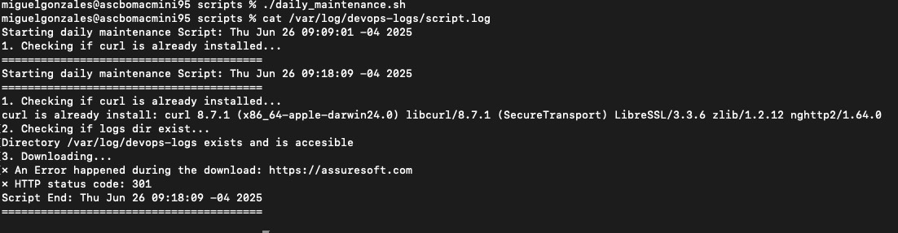
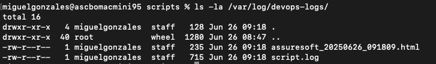

# Guía Completa de Cron y Automatización en Linux

## ¿Qué es Cron y cómo se utiliza para automatización?

Cron es un administrador de tareas de Linux que permite ejecutar comandos en un momento determinado, por 
ejemplo, cada minuto, día, semana o mes. 

Es un daemon (proceso en segundo plano) que se ejecuta desde el mismo instante en que arranca el sistema y permite automatizar tareas repetitivas sin necesidad de intervención manual.

### Componentes principales de Cron:

- Cron daemon (crond) - Es el ejecutable que permite a los usuarios realizar tareas y ejecutarlas automáticamente a una hora determinada.

- Crontab - Es un archivo de texto donde se listan todas las tareas que deben ejecutarse y el momento en el que deben hacerlo. Cada usuario puede tener su propio archivo crontab que contiene las tareas programadas.

- Cron jobs - Son las tareas individuales que se ejecutan 
automáticamente según la programación establecida.

```sh
┌───────────── minuto (0 - 59)
│ ┌───────────── hora (0 - 23)
│ │ ┌───────────── día del mes (1 - 31)
│ │ │ ┌───────────── mes (1 - 12)
│ │ │ │ ┌───────────── día de la semana (0 - 6) 
(Domingo=0)
│ │ │ │ │
* * * * * comando_a_ejecutar
```

### Operadores especiales:
- Asterisco (*) - Significa "todos los valores posibles".

- Coma (,) - Para listar múltiples valores (ej: 1,3,5).

- Guión (-) - Para especificar rangos (ej: 1-5).

- Barra (/) - Para intervalos (ej: */15 = cada 15 minutos).


# Buenas prácticas para escribir scripts de automatización

## Estructura y organización del código:

### 1. Usar encabezados apropiados:

- #!/usr/bin/env 

- set -o errexit   # Detener el script si un comando falla.

- set -o nounset   # Detener si se usan variables no declaradas.

- set -o pipefail  # Obtener el estado de salida correcto en pipelines.

### 2. Comentar el código adecuadamente:
- Utilizar comentarios para explicar el propósito y funcionalidad.

- Documentar variables importantes y lógica compleja.

- Incluir información de autor, fecha y propósito del script.

### 3. Usar variables descriptivas:

-LOG_FILE="/var/log/mi_aplicacion.log"

- BACKUP_DIR="/backup/datos"

- TIMESTAMP=$(date +"%Y%m%d_%H%M%S")

## Manejo de errores y logging:

### 4. Implementar logging detallado:

```sh
echo "$(date): Iniciando proceso de backup" >> "$LOG_FILE"
```

### 5. Verificar comandos antes de ejecutar:

```sh
if ! command -v curl &> /dev/null; then echo "ERROR: curl no está instalado"
    exit 1
fi
```

### 6. Usar códigos de salida apropiados:

```sh
if [ $? -eq 0 ]; then echo "Comando ejecutado exitosamente"
else
    echo "Error en la ejecución"
    exit 1
fi
```

## Prácticas de seguridad:

### 7. Aplicar el principio de menor privilegio:

- Ejecutar scripts con los mínimos permisos necesarios.
- Crear usuarios dedicados para tareas específicas cuando sea posible.

### 8. Validar entrada y parámetros

```sh
if [ -z "$1" ]; then echo "Error: Se requiere un parámetro"
    exit 1
fi
```

## Optimización y mantenimiento:

### 9. Probar scripts en entornos de desarrollo:

- Nunca implementar scripts directamente en producción.
- Usar entornos de prueba para validar funcionalidad.

### 10. Usar herramientas de depuración:

```sh
set -x  # Activar modo debug para ver cada comando 
ejecutado
```

## Resultado:

### Manual execution


### Check logs



# Referencias:

- [Linux manual page](https://man7.org/linux/man-pages/man8/cron.8.html)

- [Linux Total - Manual básico](https://www.linuxtotal.com.mx/index.php?cont=info_admon_006#google_vignette)

- [Cron sintax](https://docs.gitlab.com/topics/cron/)